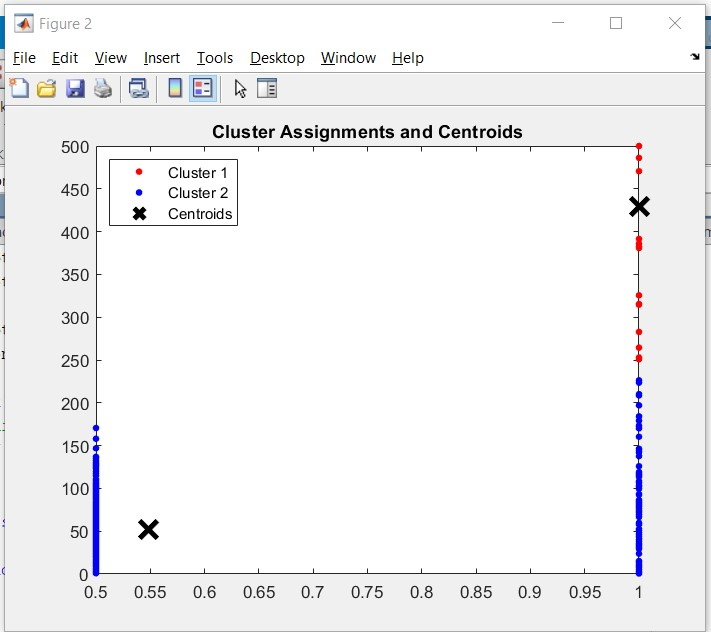

# reduction-false-positive
## risultati e descrizione dei vari metodi
tutti i metodi sotto descritti vanno eseguiti caricando le metrici di immagini DatDepth.mat \
I test verranno svolti nelle prime 1000 immagini dove 361 di esse sono NonFace.  \
I vari metodi come 1 e 2 usano i valori della depth map senza cornice aggiuntiva: DepthDATA{i}{2} \
Altrimenti i risultati sono notevolmente peggiori, ad esempio: 

    NonFace correttamente individuate: 85, NonFace erratamente individuate: 45, NonFace non individuate: 276
### metodo 1
Solo parabola sui pixel della riga centrale, matrice fixata con valori a sfondo (0 = max)
Test svolto sulle prime 1000 immagini: 

    NonFace correttamente individuate: 102, NonFace erratamente individuate: 23, NonFace non individuate: 259

Se invece della matrice fixata con valori a sfondo la fixo con valori medi (0 = mean)

    NonFace correttamente individuate: 105, NonFace erratamente individuate: 29, NonFace non individuate: 256
### metodo 2
(matrice fixata a sfondo) \
Considero sia la riga centrale che la colonna centrale se entrambi i vertici sono all'esterno dell'immagine allora viene contrassegnata come NonFace.

    NonFace correttamente individuate: 45, NonFace erratamente individuate: 5, NonFace non individuate: 316

Si nota quindi una maggiore precisione ma diminuendo di molto anche i risultati correttamente individuati.

## Prove e problemi Cluster
tutte le varie prove sono state effettuate usando un kmeans che deve trovare 2 cluster usando la distanza euclidea
### Cluster con 2 dati, risultato metodo 1 e valore assoluto della vertice.
i vertici con valore assoluto > 500 li ho tolti ed impostati a 500 perchè li ho considerati come outlier visto che comunque poi creavano ul cluster a se' visto che hanno questi valori improponibili.
codice per effettuare il cluster: 
    
    >> metodo3
    >> k_2_means_cluster

I risultati comunque ottenuti sono: 

Nel cluster 1 ho: 

    NonFace correttamente individuate: 29, NonFace erratamente individuate: 2

