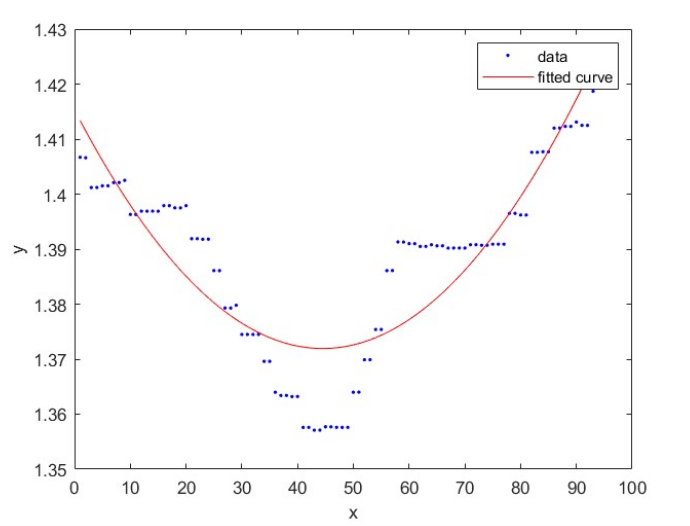
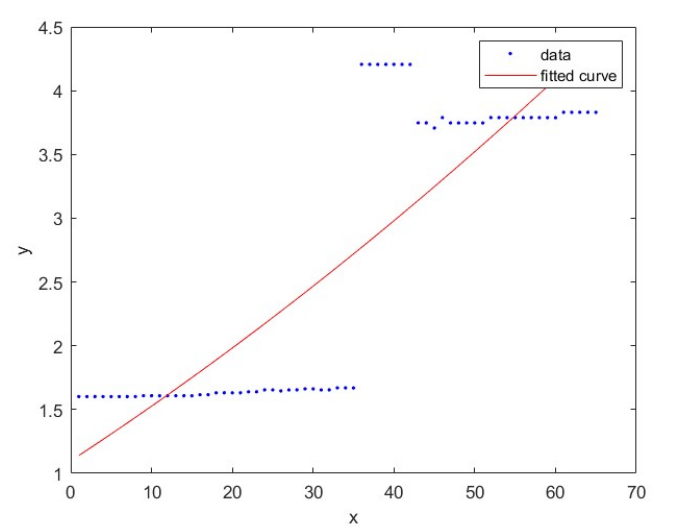
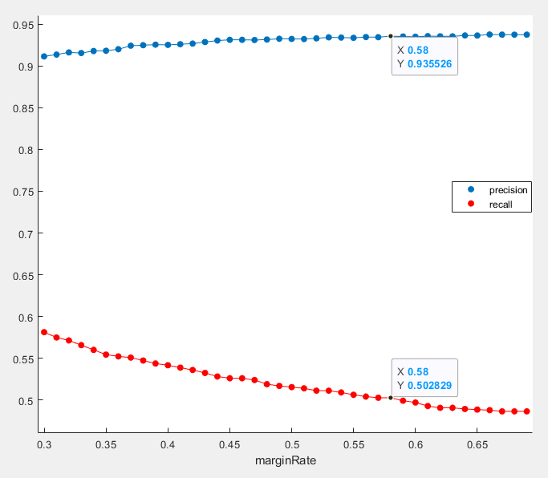

# Descrizione Metodo

## Descrizione Testuale

Data la matrice DepthDATA, considero per ogni elemento il campo (di indice 2) contenente la matrice di valori di profondità.
Richiamo quindi il metodo "FixMatrix" che va a sostituire nella matrice di profondità i valori 0 con il massimo delle profondità presenti nella matrice.
I valori a 0 di Depth infatti, indicano un "errore" nella determinazione della profondità da parte del sensore; nella maggior parte dei casi l'errore è causato da elementi troppo lontani dal sensore.\
Per questo vengono posizionati sulla massima profondità, ovvero sullo "sfondo".

Dalla matrice modificata viene poi presa la riga centrale, e si effettua una "regressione parabolica" sui valori della riga centrale.
Per la regressione parabolica si usa la funzione fit del Curve Fitting Toolbox.

I coefficienti vengono poi usati per calcolare la posizione in ascissa del vertice.

Definisco due margini calcolati come segue:

$A = matrixHCenter - marginRate \cdot matrixWidth$

$B = matrixHCenter + marginRate \cdot matrixWidth$

Dove $matrixHCenter$ è la posizione della colonna centrale della matrice di profondità e $matrixWidth$ è la larghezza della matrice.

Il coefficiente marginRate arbitrario che indica quanto ci si distanzia dal centro della matrice nel considerare i margini.

Nel caso in cui il vertice della parabola ottenuta con regressione parabolica si trovi all'esterno del range definito dai due margini OPPURE se il coefficiente di secondo grado è negativo (parabola concava), allora contrassegno l'immagine come *NonFace*, altrimenti come *Face*.

\pagebreak

Si può notare che un'immagine Face ha tendenzialmente valori più bassi (quindi più vicini alla
camera) verso il centro della matrice (causati dalla presenta della faccia, del naso, ecc.) come nel seguente esempio di fit: 

{height=31%}

Cosa che non avviene nel caso di una NonFace: 

{height=31%}

\pagebreak

Si nota inoltre che la parabola di una Face è giocoforza convessa.

Il marginRate è stato invece scelto sulla base del miglior compromesso tra Precision e Recall.

{height=31%}

Come si può vedere nel grafico all'aumentare del marginRate la Precision aumenta a discapito del Recall.

E' stato scelto per questo come compromesso un marginRate di 0,58.

## Pseudocodice

```
Per ogni elemento con indice i di DepthDATA:
  matrix = DepthDATA{i}{2}; 
  fixedMatrix = FixMatrix(matrix);
  matrixVCenter = round(size(fixedMatrix, 1)/2);
  centralrow = fixedMatrix(matrixVCenter,:);
  f = parabolic_fit(centralrow);
  coefficientValues = coeffvalues(f);
  vertice = -coefficientValues(2)/(2 * coefficientValues(1)); // -b/2a
  marginRate = 0.58;
  matrixHCenter = round(size(fixedMatrix, 2)/2);
  marginA = matrixHCenter - marginRate*size(fixedMatrix, 1);
  marginB = matrixHCenter + marginRate*size(fixedMatrix, 1);
  
  if(vertice < marginA or vertice > marginB or coefficientValues(1) < 0):
      //contrassegno come NonFace
  else:
      //contrassegno come Face
```

\pagebreak

# Analisi Complessità Temporale

Per analizzare la complessità del metodo si tiene conto della complessità temporale delle seguenti funzioni utilizzate:

+ size $= O(1)$
+ transpose $= O(1)$
+ fit $= O(1)$
+ max $= O(n)$

Per ognuna delle precedenti funzioni sono stati calcolati i vari tempi di esecuzione al variare della quantità di dati utilizzati, i risultati hanno portato alle precedenti conclusioni.

D'ora in avanti considereremo: 

+ n = numero di immagini 
+ m = dimensione totale dell'immagine

Il metodo quindi ha complessità temporale pari a $O(n \cdot m)$ in quanto per ogni immagine viene calcolato il massimo una volta e poi viene effettuato il controllo degli zeri sulla matrice, valore per valore.

# Risultati e Prestazione del metodo

Il metodo ottiene quindi i seguenti risultati in termini di recall e precision:

$Precision = \frac{TruePositive}{TruePositive + FalsePositive} = \frac{711}{711+49} = 0.9355 \approx 94\%$


$Recalll = \frac{TruePositive}{TruePositive + FalseNegative} = \frac{711}{711+703} = 0.5028 \approx 50\%$

Infatti vengono individuate correttamente 711 non Face con soli 49 falsi positivi.

\pagebreak

# Legenda file

+ metodo1.m contiene l'effettivo programma che controllando tutte le immagini presenti dentro DepthDATA salva nel vettore results se è faccia (0.5) o non faccia (1)
+ checkResults.m a partire dal vettore results, conteggia il numero di NonFace correttamente individuate o erratamente individuate
+ fixMatrix.m contiene la funziona fixMatrix che data una matrice di profondità sostituisce i valori 0 con il massimo della profondità
+ testValori.m testa i vari valori di marginRate (da 0.3 a 0.7) calcolandone di volta in volta Precision e Recall. Alla fine mostra l'andamento del tutto
+ risultatiTestValori.fig mostra il grafico risultante dall'esecuzione del file testValori.m con l'andamento di Precision e Recall.
